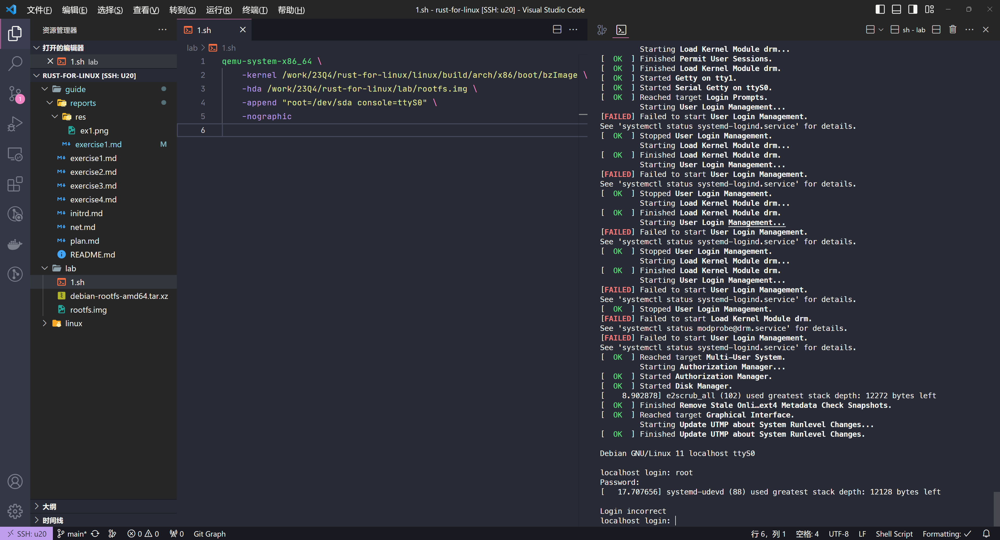

# Exercise 1


顺利构建。构建时，提示了一些类似下面的 warnings：
```
vmlinux.o: warning: objtool: <mangled symbol>+0x<offset>: 'naked' return found in RETHUNK build
```

> 对于 Debian/Ubuntu，可以用官方脚本安装 LLVM 指定版本的所有工具。我之前的脚本：
> 
> ```sh
> wget https://apt.llvm.org/llvm.sh
> chmod +x llvm.sh
> 
> # 安装 LLVM v16 的所有工具，注意走代理
> sudo ./llvm.sh 16 all
> 
> # 增加软链接，去掉 -16 后缀
> for file in /usr/bin/*-16
> do
>     base_name=$(basename -- "$file")
>     name_without_version="${base_name%-16}"
> 
>     sudo ln -s "$file" "/usr/bin/$name_without_version"
> done
> ```

顺利在 qemu 上运行，然而不知道这个 rootfs 的密码，尴尬了...


