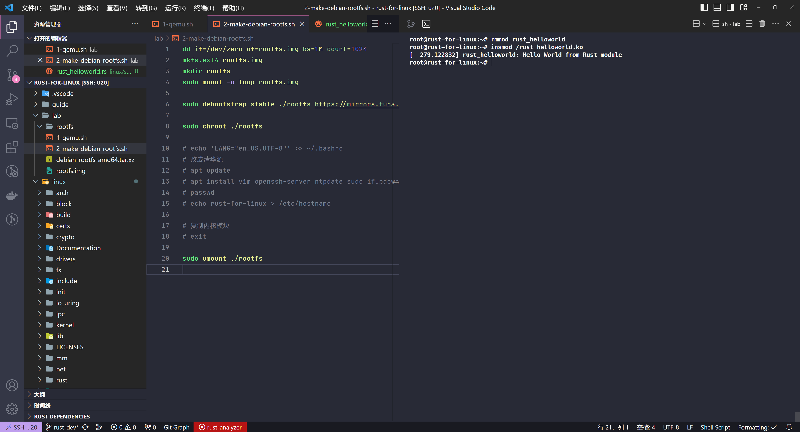

# Exercise 2

成功运行，如图：



## 过程

### 编译模块

跟着教程，正常编译。

### 准备 rootfs

```bash
dd if=/dev/zero of=rootfs.img bs=1M count=1024
mkfs.ext4 rootfs.img
mkdir rootfs
sudo mount -o loop rootfs.img

sudo debootstrap stable ./rootfs https://mirrors.tuna.tsinghua.edu.cn/debian/

sudo chroot ./rootfs
# echo 'LANG="en_US.UTF-8"' >> ~/.bashrc
# 改清华源
# apt update
# apt install vim openssh-server ntpdate sudo ifupdown net-tools udev iputils-ping wget dosfstools unzip binutils libatomic1
# passwd
# echo rust-for-linux > /etc/hostname

# 复制内核模块
# exit

sudo umount ./rootfs
```

### 启动虚拟机

```bash
qemu-system-x86_64 \
    -kernel ../linux/build/arch/x86/boot/bzImage \
    -hda ./rootfs.img \
    -append "root=/dev/sda console=ttyS0" \
    -nographic
```
