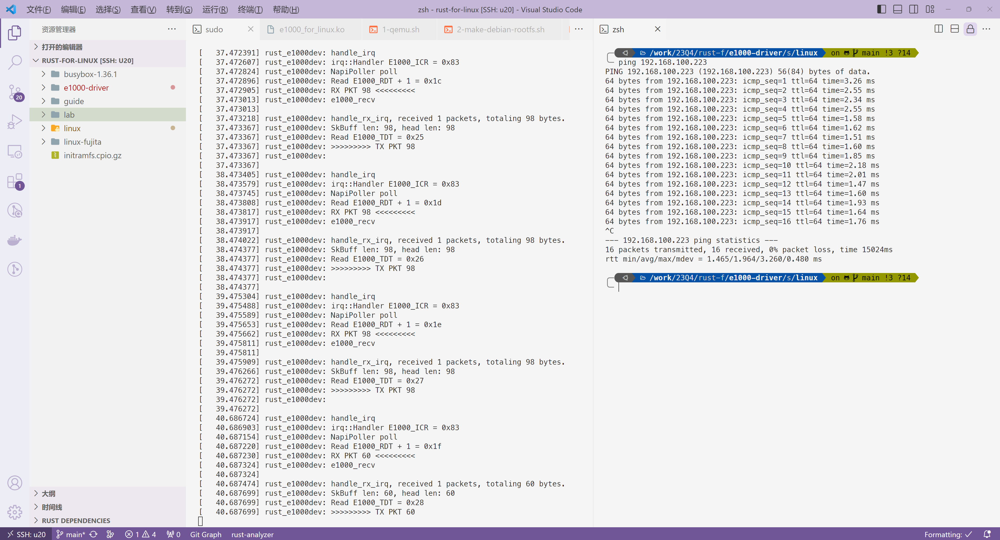

# Exercise 3&4

成功跑起来，ping 通，如图：



## 过程

### 1. `e1000-driver` 填充功能

参见：https://github.com/FuuuOverclocking/e1000-driver

### 2. 编译内核模块，制作新的 initramfs，运行虚拟机

```sh
# 下载 busybox-1.36.1，编译安装
# 复制 busybox-1.36.1/_install 到 lab 目录下，命名为 initramfs

MYDIR=/work/23Q4/rust-for-linux

# 编译内核模块
cd $MYDIR/e1000-driver/src/linux
make KDIR=$MYDIR/linux-fujita
# 拷贝到 initramfs 中
cp $MYDIR/e1000-driver/src/e1000_for_linux.ko $MYDIR/lab/initramfs/lib/modules

# 制作 initramfs
cd $MYDIR/lab/initramfs
find . -print0 | cpio --null -ov --format=newc | gzip -9 > $MYDIR/lab/initramfs.cpio.gz

qemu-system-x86_64 \
    -kernel $MYDIR/linux-fujita/arch/x86/boot/bzImage \
    -initrd $MYDIR/lab/initramfs.cpio.gz \
    -smp 2 \
    -m 512M \
    -append "init=/init console=ttyS0" \
    -netdev tap,id=nd0,script=$MYDIR/lab/4-ifup.sh,downscript=$MYDIR/lab/5-ifdown.sh \
    -device e1000,netdev=nd0 \
    -nographic
```

### 附：网络设置脚本

在启动 QEMU 虚拟机时，使用了 netdev 的 script 和 downscript 选项，脚本分别为

#### `lab/4-ifup.sh`

```sh
#!/bin/sh
ip link add br0 type bridge
ip addr add 192.168.100.50/24 brd 192.168.100.255 dev br0
ip link set dev br0 up

ip tuntap add dev $1 mode tap
ip link set dev $1 master br0
ip link set dev $1 up
```

注：这里的设备名 `$1` 会由 QEMU 自动生成。

#### `lab/5-ifdown.sh`

```sh
#!/bin/sh
ip link set dev $1 down
ip link set dev $1 nomaster
ip tuntap del dev $1 mode tap

ip link set dev br0 down
ip link delete br0 type bridge
```

### 附：`initramfs/init` 脚本

```sh
#!/bin/sh

mount -t proc none /proc
mount -t sysfs none /sys
mount -t tmpfs none /tmp
mount -t devtmpfs none /dev

insmod /lib/modules/e1000_for_linux.ko

ip addr add 127.0.0.1/32 dev lo
ip link set lo up

ip addr add 192.168.100.223/24 dev eth0
ip link set eth0 up

export 'PS1=(rfl)> '
exec /bin/sh
```